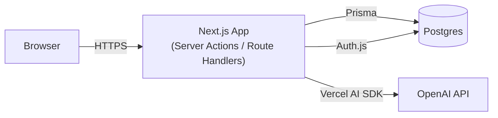
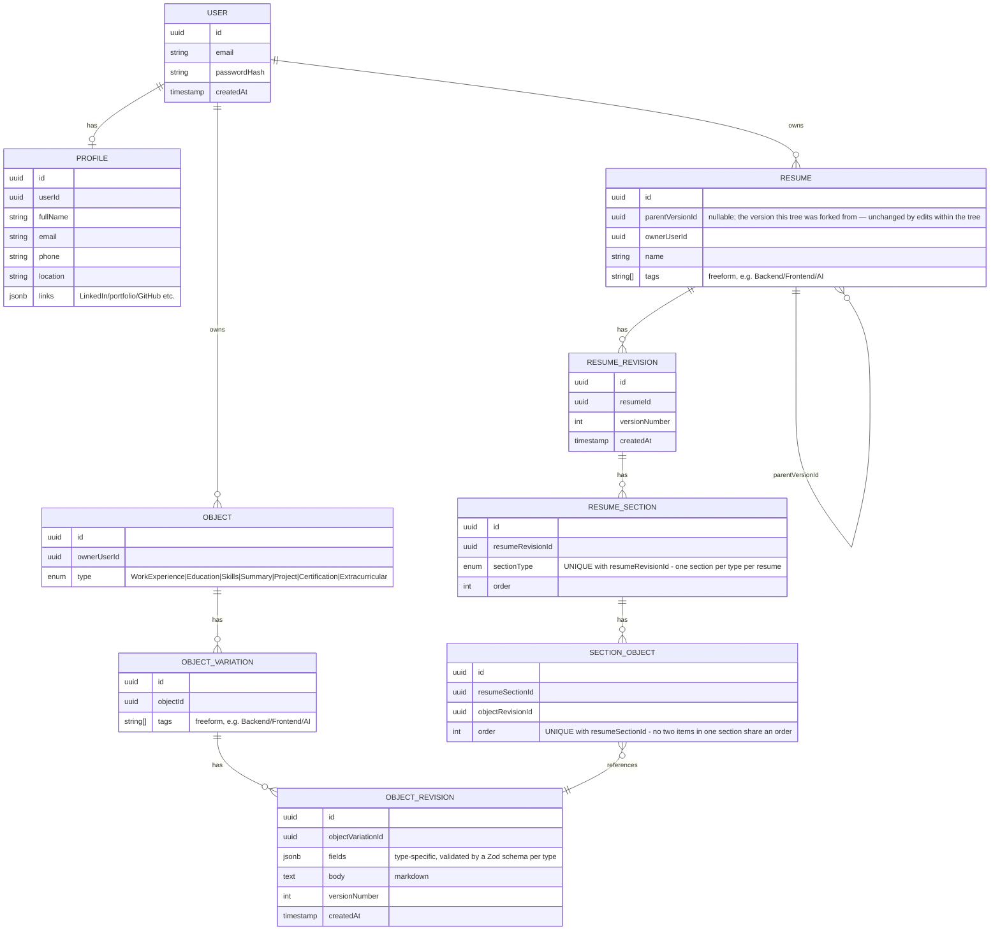
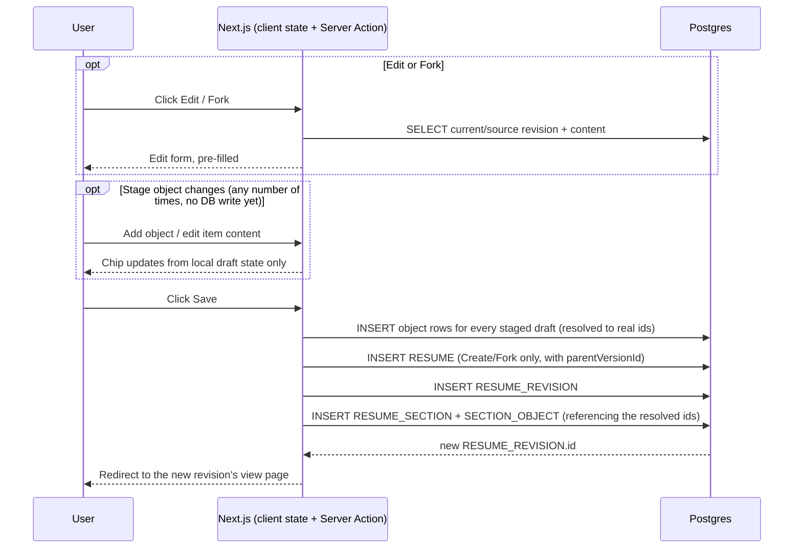
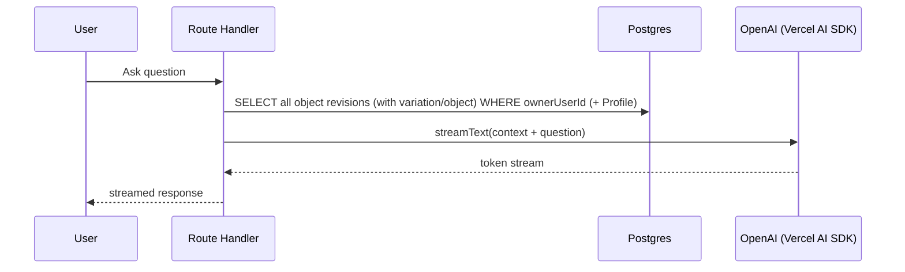
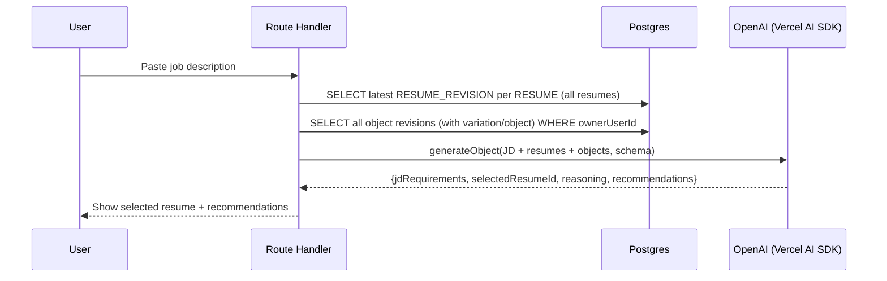

# Resume Version Control — Design (L1 + L2)

## Status

Design approved by user, covering the first sub-project of the mentorship roadmap:

- **L1 (CRUD App):** object-based resume/version-control system, dashboards.
- **L2 (Basic AI, no memory/tools):** AI Career Q&A + JD-based resume selection & optimization.

Out of scope for this spec: **L3** (deployment) and **L4** (AI agent layer — memory/tools), and the "nice to have" features (PDF/Word export/import, text-based editor).

## Problem & Users

Job seekers who apply to multiple roles end up maintaining duplicated, hand-edited copies of their resume, and struggle to tell which experiences/content to highlight for a given job description. This app manages resumes as **reusable, versioned resume objects** (git-like version control, scoped to a single document type) and adds AI assistance for career advice and JD-based tailoring.

## User Stories (from requirements)

**Resume version control:** create an object-based resume from scratch; edit an existing resume and create a new version; fork an existing resume into a separate version; view a resume and its version history; visualize all resumes and their version/fork relationships.

**Object version control:** view resume objects and their version history.

**AI features:** receive AI-powered career advice based on career context; provide a job description and have AI select the most relevant resume and recommend how to optimize it.

## Architecture

Single deployable Next.js app — no separate backend service.

- **Frontend/backend:** Next.js + TypeScript. Server Actions handle versioning writes (create/edit/fork). Route Handlers serve the AI endpoints (needed for streaming the Q&A chat).
- **Database:** Postgres via Prisma.
- **Auth:** Auth.js (Credentials provider, JWT sessions), scoping all data to `ownerUserId`.
- **AI:** OpenAI API via the Vercel AI SDK (`streamText` for Q&A, `generateObject` for JD optimization's structured output).

## Data Model

Two decisions shape this model, both applied consistently:

1. **Identity is split from history via real foreign keys, not self-referencing columns.** Objects and resumes each have a dedicated identity table (`OBJECT`, `RESUME`) separate from their history table(s) — no version row doubles as its own identity anchor.
2. **Objects have three identity levels; resumes have two.** An `OBJECT` (e.g. "my Google work experience") can have multiple **variations** — tailored rewrites for different scenarios (a backend-flavored write-up vs. a frontend-flavored one) — each an `OBJECT_VARIATION` row with its own **linear** history of `OBJECT_REVISION` rows. Objects never form a parent/child tree at any level. A `RESUME` is a tree/identity on its own (no umbrella level above it), with a linear history of `RESUME_REVISION` rows; `RESUME.parentVersionId` records the resume a fork started from, fixed once at fork time.

**Key semantics:**

- **Terminology:** an **object** is the conceptual umbrella (`OBJECT` row). A **variation** is one tailored branch of an object (`OBJECT_VARIATION` row, `objectId` FK), with its own linear history. A **revision** is one edit within a variation's history (`OBJECT_REVISION` row, `objectVariationId` FK).
- **Editing a variation** inserts a new `OBJECT_REVISION` under the same `objectVariationId`, with `versionNumber` = current highest plus one. Existing resumes keep pointing at whichever specific `OBJECT_REVISION` they already reference.
- **Creating a new variation** (fork, pre-filled from an existing variation's latest revision) inserts a new `OBJECT_VARIATION` under the same `objectId`, plus its first `OBJECT_REVISION` (`versionNumber` = 1).
- The Object Dashboard groups by `OBJECT` (one card per object), with one sub-card per `OBJECT_VARIATION` showing only its latest revision — see Dashboards below.

| Entry point | Creates | Variation | initial form content |
|---|---|---|---|
| **Create** (new object from scratch) | `OBJECT` + `OBJECT_VARIATION` + `OBJECT_REVISION` | new | empty |
| **Edit** (within a variation) | `OBJECT_REVISION` only | unchanged | pre-filled from the revision being edited |
| **New Variation** (fork within an object) | `OBJECT_VARIATION` + `OBJECT_REVISION` | new (same `objectId`) | pre-filled from the source variation's latest revision |

- **Editing a resume** inserts a new `RESUME_REVISION` under the same `resumeId`, with `versionNumber` = current highest plus one. A resume's current/"latest" revision is whichever was most recently created.
- **Forking a resume** inserts a new `RESUME` row (`parentVersionId` = the source resume's `id`) plus its first `RESUME_REVISION`.
- **`SECTION_OBJECT` references `resumeSectionId` and `objectRevisionId` directly** — real FK-enforced section membership. `RESUME_SECTION` is keyed by `(resumeRevisionId, sectionType)` (`UNIQUE`) and can exist with zero items.
- **Write-time validation:** creating/editing/forking a resume rejects the write if any item's `OBJECT.type` doesn't match the `sectionType` of the section it's nested under.
- **`(resumeSectionId, order)` is `UNIQUE`** on `SECTION_OBJECT` — no two items in the same section can share an order value.
- **`fields` is JSONB**, validated at the application layer by a Zod schema per `type`. Every query pattern in this app fetches by ID or by `ownerUserId`; nothing filters on values inside `fields`, so a GIN/expression index can be added later if that changes.
- **Profile** (name/email/phone/location/links, shown in a resume's header) is a single live, unversioned row per user — resumes always render the current profile.
- **Tags** on `OBJECT_VARIATION` are shared by every revision under that variation. `RESUME` carries its own `tags` directly. Both are freeform strings, independent of the identity/history structure above. The object list page fetches every revision (across every variation) for a user (`type` filtered server-side) and applies tag filtering client-side, using each revision's variation tags. Existing tags are surfaced as autocomplete suggestions to reduce accidental duplicates (`Backend` vs `backend`).

## Core Flows

**Writing a resume revision** — Create, Edit, and Fork all resolve to the same underlying write: a `RESUME_REVISION` insert (plus a `RESUME` insert for Create/Fork) + `RESUME_SECTION`/`SECTION_OBJECT` inserts, made only when the user submits — not when they click Create/Edit/Fork.

**Editing or creating an object's content while authoring a resume is staged, not written.** Inside the resume form, adding a new object or editing an item's content only updates local form state (fields/body/tags) — no `OBJECT_REVISION` row exists yet. Only when the user clicks the resume's own Save does the app resolve every staged object change into a real insert (`createObject` / `editObjectRevision` / `forkObjectVariation`, as applicable), *then* insert the `RESUME`/`RESUME_REVISION`/`RESUME_SECTION`/`SECTION_OBJECT` rows referencing the now-real object revision ids. These are two sequential phases, not one transaction (see "Error Handling" below) — but neither runs until the user submits, so navigating away from an in-progress resume edit leaves no trace in the object tables. This staging behavior is specific to editing objects *through* the resume form; the standalone Object Dashboard (see Dashboards below) still writes each object edit/fork immediately, since there's no larger "submit" to batch into there.

| Entry point | Creates | `RESUME.parentVersionId` | initial form content |
|---|---|---|---|
| **Create** | `RESUME` + `RESUME_REVISION` | `null` | empty |
| **Edit** | `RESUME_REVISION` only | unchanged | pre-filled from the revision being edited |
| **Fork** | `RESUME` + `RESUME_REVISION` | source resume's `id` | pre-filled from the source revision |

**AI Career Q&A** (streaming, "career context" = every version of every one of the user's objects):

**JD-based Selection & Optimization** (single structured-output call — see "AI Feature Details" for why):

**Dashboards** (plain reads, no AI, no sequence diagram needed):

- **Resume Dashboard:** lists `RESUME` rows directly (each already one distinct resume); draws fork arrows by following `parentVersionId` links between `RESUME` rows.
- **Object Dashboard:** groups `OBJECT_VARIATION` by `objectId` — one card per object. Within it, one sub-card per `OBJECT_VARIATION`, showing only that variation's latest revision, each with **Edit** (new `OBJECT_REVISION`, same variation) and **New Variation** (new `OBJECT_VARIATION`, same `objectId`) actions. Clicking a variation sub-card opens a detail popup with that variation's full history (every `OBJECT_REVISION` under its `objectVariationId`, oldest-to-newest) and the list of resumes using it — joining `SECTION_OBJECT → RESUME_SECTION → RESUME_REVISION → RESUME` across every revision under that variation, not just the latest. (Tag filtering is client-side on the object list page, not a query concern here.)

## AI Feature Details

**Career Q&A:** no memory across sessions (per the L2 "no memory, no tool" scope) — each question is a fresh call with the user's full object set as context.

**JD-based Selection & Optimization:**

- Compares the JD against the **latest version of each resume tree** (not every historical version).
- The AI is given **all** of the user's object versions, not just the ones currently used in resumes, so it can recommend swapping in a different existing variation (e.g. "use your other phrasing of the Google role").
- Output is **advice only** — the AI never auto-creates a new resume version; the user applies suggested changes manually, which then goes through the normal edit flow above.
- **No embeddings/vector search.** A user's object/resume corpus (tens to low hundreds of items) fits comfortably in an LLM context window, so there's no retrieval-filtering problem to solve. Full-context reasoning is also more accurate here than embedding similarity would be: embedding distance is a single fuzzy topical-similarity score (can't reliably distinguish "5 years Python" from "5 years Java" the way a JD requirement needs to), whereas the LLM reading full text can check specific requirements directly and explain its reasoning. Embeddings become worth it only if the corpus grows too large to fit in context — not the case here.
- **Single call, not two.** One `generateObject` call with a schema (`{ jdRequirements, selectedResumeId, reasoning, recommendations }`) does JD analysis and matching together — the schema forces the JD-requirements breakdown to be part of the output, so there's no need for a separate extraction call. A two-call pipeline (extract requirements, then match) would only pay off if the JD analysis needed to be cached/reused independently, which isn't a current requirement; that kind of multi-step pipeline is better suited to L4 (agent layer) work.

## Error Handling

- **Data isolation is the one trust boundary that's never simplified away:** every query/mutation filters by the authenticated session's `ownerUserId` — a client-supplied resume/object ID is always checked for ownership before use.
- **AI calls:** `streamText`/`generateObject` wrapped in try/catch; on failure/timeout, show a retryable error instead of a blank state. `generateObject`'s Zod schema validation catches malformed structured output from the model (the Vercel AI SDK retries automatically on schema mismatch).
- **Empty states:** Career Q&A and JD optimization both need a friendly message when the user has zero objects/resumes yet, instead of calling the AI with empty context.
- **Concurrent saves:** every save is an immutable insert, never an update, so two edits started from the same version simply produce two diverging versions — there's no conflict to detect or lock against; this falls out of the data model.
- **Field validation:** each object `type`'s Zod schema validates `fields` on write, rejecting malformed data before persistence.
- **Resume submit is two sequential phases, not one transaction:** resolving staged object drafts (`OBJECT`/`OBJECT_VARIATION`/`OBJECT_REVISION` inserts) happens first, then the `RESUME`/`RESUME_REVISION`/`RESUME_SECTION`/`SECTION_OBJECT` insert (itself already atomic as one nested Prisma write). No `$transaction` wraps the two phases together. If an object draft fails validation, submission stops there and the resume is never written — surfaced as an error on that specific item, not a whole-form error. If a later phase fails after some object drafts already resolved, those object rows remain as real, valid, unused rows — not a broken state, since an `OBJECT_REVISION` existing without any resume referencing it is already normal (identical to one created directly via the Object Dashboard). The data model has no invariant that requires full atomicity across the two phases, so no shared Prisma transaction handle is threaded across `objects/versioning.ts` and `resumes/versioning.ts`.

## Testing Approach

Implementation follows TDD. Priority coverage: versioning correctness (`RESUME_REVISION` linked to the correct `RESUME`, and `RESUME.parentVersionId` set correctly on edit vs. fork; `OBJECT_REVISION` linked to the correct `OBJECT_VARIATION` on edit vs. new-variation fork), an ownership-check test per mutation (user A cannot read/write user B's rows), and a schema-validation test for the AI structured output. AI response *quality* is checked manually, since LLM output isn't deterministic.
