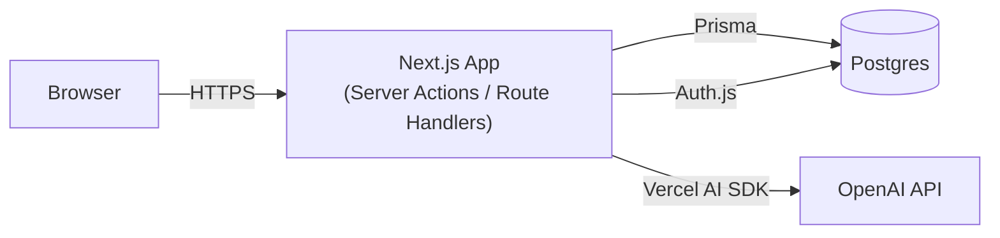
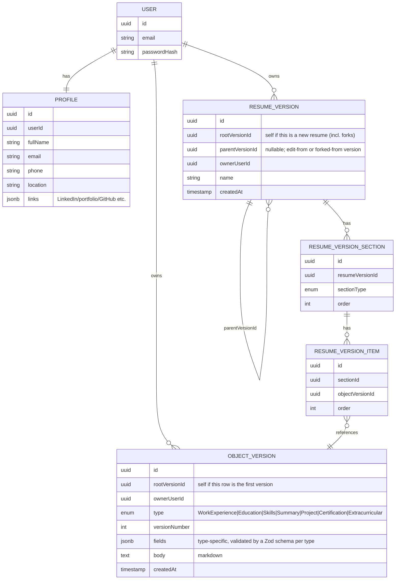
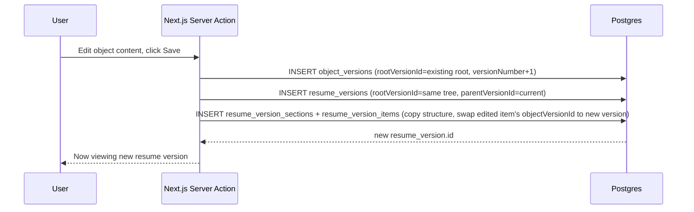
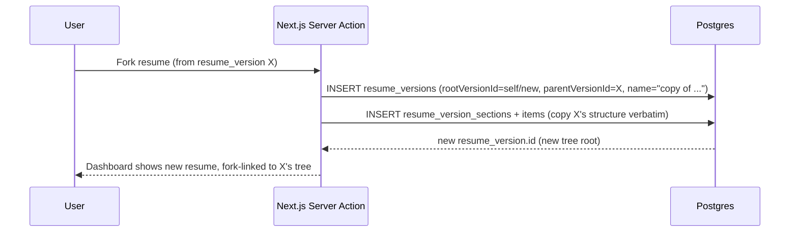
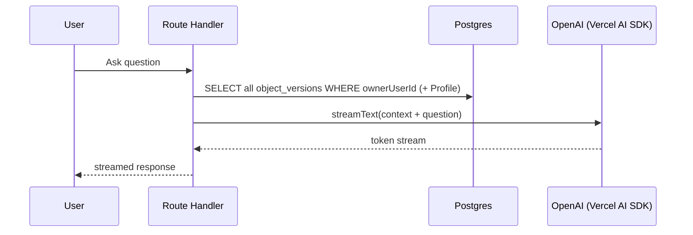
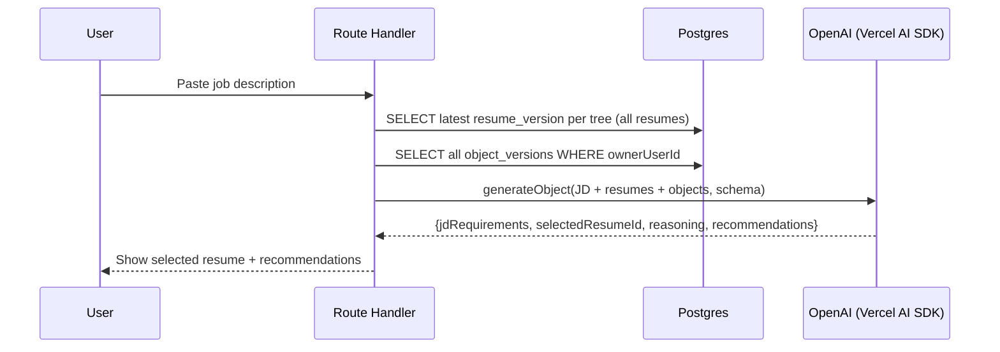

# Resume Version Control — Design (L1 + L2)

## Status

Design approved by user, covering the first sub-project of the mentorship roadmap:

- **L1 (CRUD App):** object-based resume/version-control system, dashboards.
- **L2 (Basic AI, no memory/tools):** AI Career Q&A + JD-based resume selection & optimization.

Out of scope for this spec: **L3** (deployment) and **L4** (AI agent layer — memory/tools), and the "nice to have" features (PDF/Word export/import, text-based editor).

## Problem & Users

Job seekers who apply to multiple roles end up maintaining duplicated, hand-edited copies of their resume, and struggle to tell which experiences/content to highlight for a given job description. This app manages resumes as **reusable, versioned resume objects** (git-like version control, scoped to a single document type) and adds AI assistance for career advice and JD-based tailoring.

## User Stories (from requirements)

**Resume version control:** create an object-based resume from scratch; edit an existing resume and create a new version; fork an existing resume into a separate version; view a resume and its version history; visualize all resumes and their version/fork relationships.

**Object version control:** view resume objects and their version history.

**AI features:** receive AI-powered career advice based on career context; provide a job description and have AI select the most relevant resume and recommend how to optimize it.

## Architecture

Single deployable Next.js app — no separate backend service.

- **Frontend/backend:** Next.js + TypeScript. Server Actions handle versioning writes (create/edit/fork). Route Handlers serve the AI endpoints (needed for streaming the Q&A chat).
- **Database:** Postgres via Prisma.
- **Auth:** Auth.js (credentials + optional Google OAuth), scoping all data to `ownerUserId`.
- **AI:** OpenAI API via the Vercel AI SDK (`streamText` for Q&A, `generateObject` for JD optimization's structured output).

## Data Model

Two decisions shape this model, both applied consistently:

1. **No separate "identity" tables.** A `resumes` table and an `objects` table were considered and dropped — each version row carries its own identity via a self-referencing `rootVersionId`, collapsing "identity + history" into one table per concept.
2. **Object versioning is linear; resume versioning is a tree.** Objects only ever get new versions (edits) under the same `rootVersionId` — no forking at the object level. Resumes fork, so `resume_versions` also needs `parentVersionId` to capture the edit/fork lineage edge, on top of `rootVersionId` for "which resume/tree this belongs to."

**Key semantics:**

- **Editing an object** creates a new `object_version` row (`rootVersionId` unchanged, `versionNumber` incremented) only on explicit save — not per keystroke. Existing resumes that reference the old version are unaffected; only resumes edited afterward pick up the new one.
- **Editing a resume** creates a new `resume_version` row with `rootVersionId` unchanged (same tree) and `parentVersionId` = the version edited from. Edits are only ever made from a tree's current head (its most recent version) — editing from an older version isn't supported, since forking is the mechanism for intentionally diverging history. This keeps each tree's version chain linear and "latest version per resume," used by the JD-optimization feature, unambiguous.
- **Forking a resume** creates a new `resume_version` row that starts a **new tree**: `rootVersionId` = itself, `parentVersionId` = the source version (cross-tree pointer, for lineage display only — no merging back).
- **`fields` is JSONB, not per-type relational columns**, to avoid a sparse table with a column for every possible field across all 7 object types. "Fixed schema" is enforced at the application layer via a Zod validator per `type`, not via the DB column shape. Every query pattern in this app fetches by ID or by `ownerUserId` — nothing filters on values *inside* `fields` — so JSONB costs nothing here; a GIN/expression index can be added later if that changes.
- **Profile** (name/email/phone/location/links, shown in a resume's header) is a single live, unversioned row per user — resumes always render the current profile, not a snapshot.

## Core Flows

**Edit** (editing an object referenced by a resume):

**Fork:**

**AI Career Q&A** (streaming, "career context" = all of the user's objects):

**JD-based Selection & Optimization** (single structured-output call — see "AI Feature Details" for why):

**Dashboards** (plain reads, no AI, no sequence diagram needed):

- **Resume Dashboard:** groups `resume_versions` by `rootVersionId` to list distinct resumes; draws fork arrows by following `parentVersionId` links that cross into a different `rootVersionId`.
- **Object Dashboard:** groups `object_versions` by `rootVersionId`; for each version, joins `resume_version_item → resume_version_section → resume_version` to show which resume(s) currently use it.

## AI Feature Details

**Career Q&A:** no memory across sessions (per the L2 "no memory, no tool" scope) — each question is a fresh call with the user's full object set as context.

**JD-based Selection & Optimization:**

- Compares the JD against the **latest version of each resume tree** (not every historical version).
- The AI is given **all** of the user's object versions, not just the ones currently used in resumes, so it can recommend swapping in a different existing variation (e.g. "use your other phrasing of the Google role").
- Output is **advice only** — the AI never auto-creates a new resume version; the user applies suggested changes manually, which then goes through the normal edit flow above.
- **No embeddings/vector search.** A user's object/resume corpus (tens to low hundreds of items) fits comfortably in an LLM context window, so there's no retrieval-filtering problem to solve. Full-context reasoning is also more accurate here than embedding similarity would be: embedding distance is a single fuzzy topical-similarity score (can't reliably distinguish "5 years Python" from "5 years Java" the way a JD requirement needs to), whereas the LLM reading full text can check specific requirements directly and explain its reasoning. Embeddings become worth it only if the corpus grows too large to fit in context — not the case here.
- **Single call, not two.** One `generateObject` call with a schema (`{ jdRequirements, selectedResumeId, reasoning, recommendations }`) does JD analysis and matching together — the schema forces the JD-requirements breakdown to be part of the output, so there's no need for a separate extraction call. A two-call pipeline (extract requirements, then match) would only pay off if the JD analysis needed to be cached/reused independently, which isn't a current requirement; that kind of multi-step pipeline is better suited to L4 (agent layer) work.

## Error Handling

- **Data isolation is the one trust boundary that's never simplified away:** every query/mutation filters by the authenticated session's `ownerUserId` — a client-supplied resume/object ID is always checked for ownership before use.
- **AI calls:** `streamText`/`generateObject` wrapped in try/catch; on failure/timeout, show a retryable error instead of a blank state. `generateObject`'s Zod schema validation catches malformed structured output from the model (the Vercel AI SDK retries automatically on schema mismatch).
- **Empty states:** Career Q&A and JD optimization both need a friendly message when the user has zero objects/resumes yet, instead of calling the AI with empty context.
- **Concurrent saves:** every save is an immutable insert, never an update, so two edits from the same `parentVersionId` simply produce two diverging versions — there's no conflict to detect or lock against; this falls out of the data model.
- **Field validation:** each object `type`'s Zod schema validates `fields` on write, rejecting malformed data before persistence.

## Testing Approach

Implementation follows TDD. Priority coverage: versioning correctness (`rootVersionId`/`parentVersionId` set correctly on edit vs. fork), an ownership-check test per mutation (user A cannot read/write user B's rows), and a schema-validation test for the AI structured output. AI response *quality* is checked manually, since LLM output isn't deterministic.
